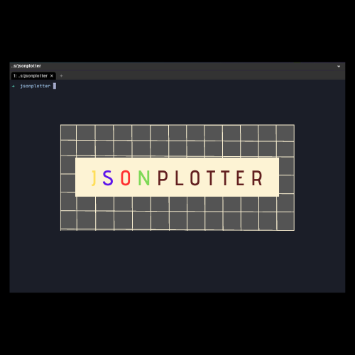
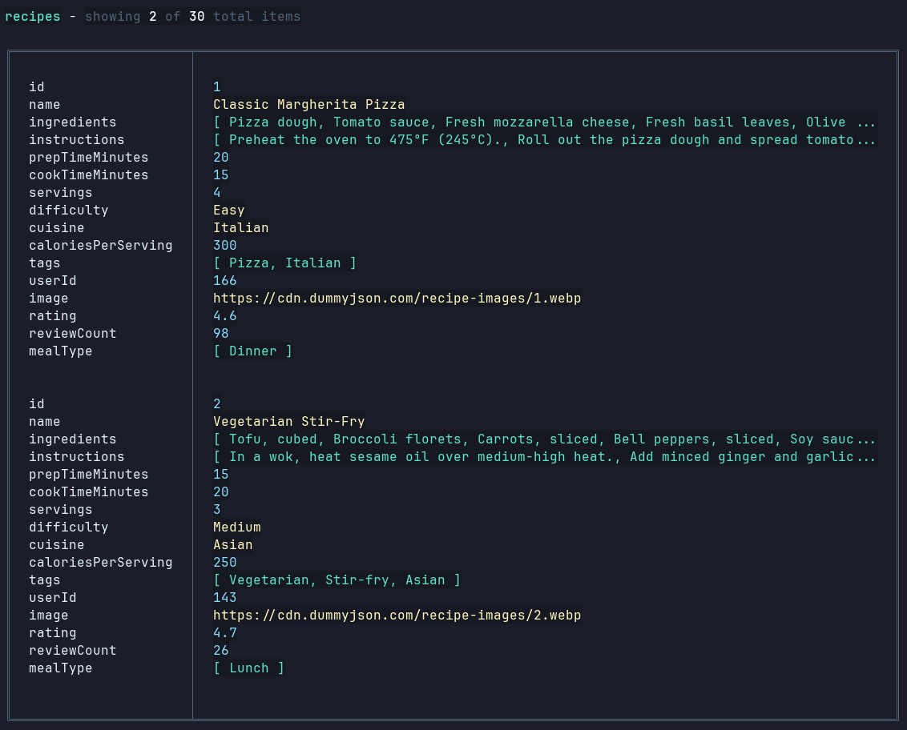
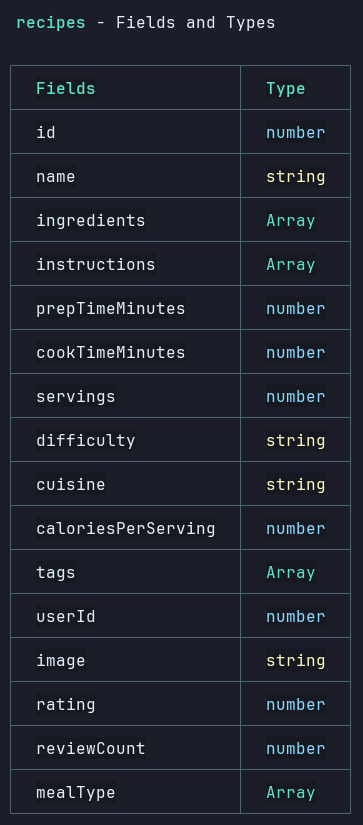

# jsonplotter

Jsonplotter is a CLI tool, which creates a visual representasion of JSON data either from an api or from local JSON file from project folder.

## Install:

```javascript
npm install jsonplotter --save-dev
```

```javascript
npx jsonplotter
```

## Commands:

### `plot` Command

The plot command lets you visualize JSON data either from an api or local JSON file.

**Syntax:**

```javascript
jsonplotter plot [options]
```

**Options:**

- -f, --file \<path>:

  Use this option to visualize from local JSON file.

  Example:

  ```javascript
  jsonplotter plot --file "src/data/users.json"
  ```

- -u, --url \<url>:

  Use this option to visualize data from an api.

  ```javascript
  jsonplotter plot --url "https://dummyjson.com/recipes?limit=5"
  ```

- -l, --limit \<number>

  use this optional flag to limit the number of items shown on table. Defaults to 3.

  ```javascript
  jsonplotter plot --file "src/data/items.json" --limit 5
  ```

## Examples:

```javascript
jsonplotter plot --u "https://dummyjson.com/recipes" -l 2
```




## License:

This software is licensed under the [MIT](LICENSE)

## Contributing

All contributions are welcome, please use the [Issues tracker](https://github.com/anttiromppanen/jsonplotter/issues)
